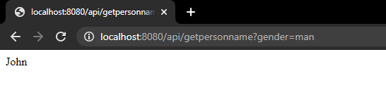
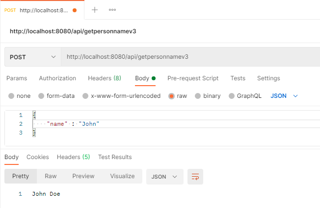
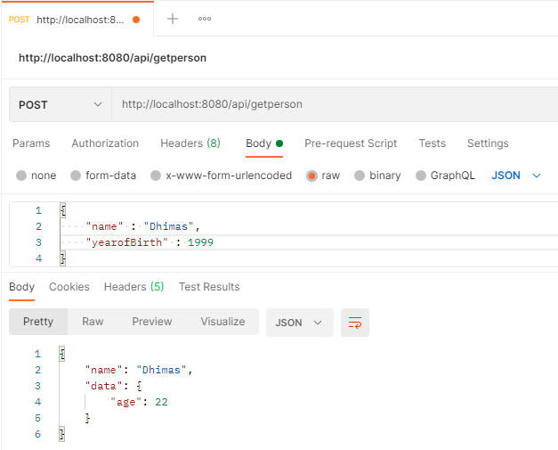
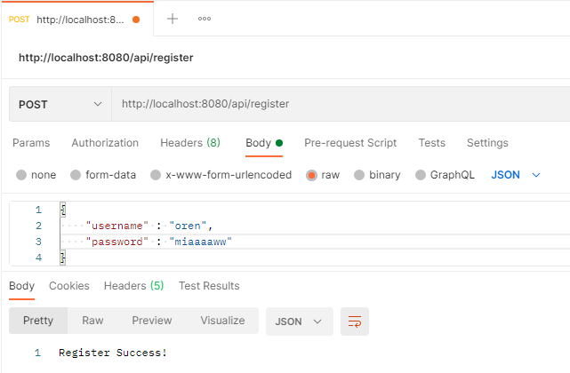
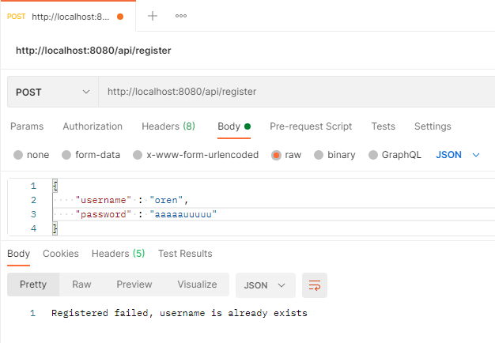
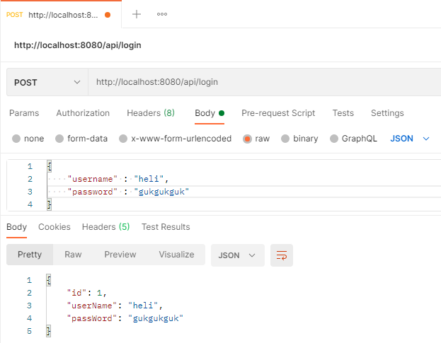
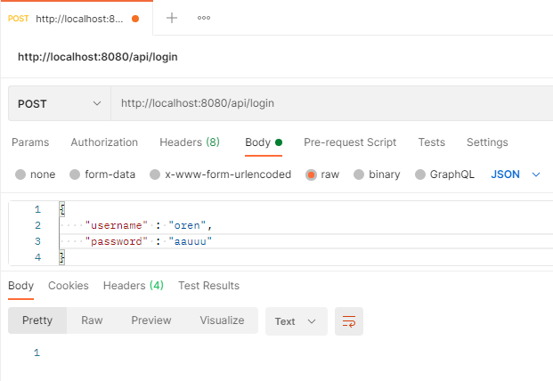

# Learning Spring
### Screenshot API Test
GET : localhost:8080/api/getpersonname

GET : localhost:8080/api/getpersonnamev2

POST : localhost:8080/api/getpersonnamev3

POST : localhost:8080/api/getperson

POST : localhost:8080/api/register (success)

POST : localhost:8080/api/register (failed)

POST : localhost:8080/api/login (success)

POST : localhost:8080/api/login (failed)

