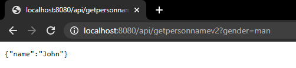

# Learning Spring
### Screenshot API Test
GET : localhost:8080/api/getpersonname 
  
GET : localhost:8080/api/getpersonnamev2 
  
POST : localhost:8080/api/getpersonnamev3 
  
POST : localhost:8080/api/getperson 
  
POST : localhost:8080/api/register (success) 
  
POST : localhost:8080/api/register (failed) 
  
POST : localhost:8080/api/login (success) 
  
POST : localhost:8080/api/login (failed) 

